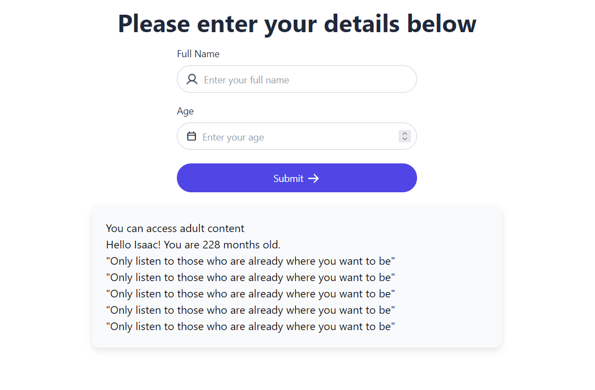

# Personalized Webpage Project

This project is an interactive personalized webpage built using HTMl, JavaScript, and CSS. The webpage collects a users age and name, stores it in localStorage, and displays personalized content.

## Contributor

Isaac Ndungu

## Project Brief 
 

key Features of the project include:

    - Displaying personalized greeting
    - calculating the users age in months
    - display motivational quote five times

## Technologies Used

- HTML
- CSS - Tailwind
- Javasctript 

## Usage Instructions

1. open the project in your browser using the following live URL: https://isaac-ndungu.github.io/personalized-webpage/

2. Enter your `name` and `age`

3. Then click submit to get personalized greeting.

## Screenshot

